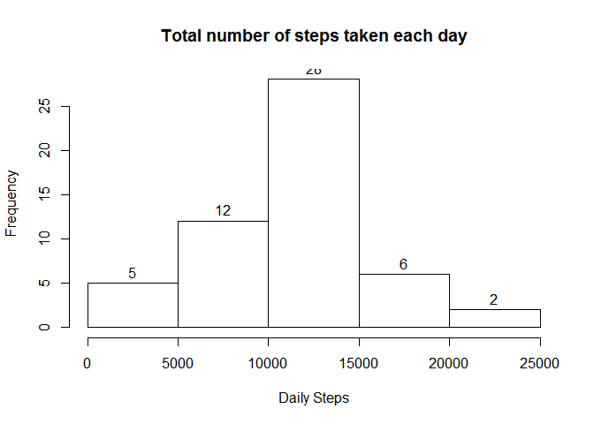
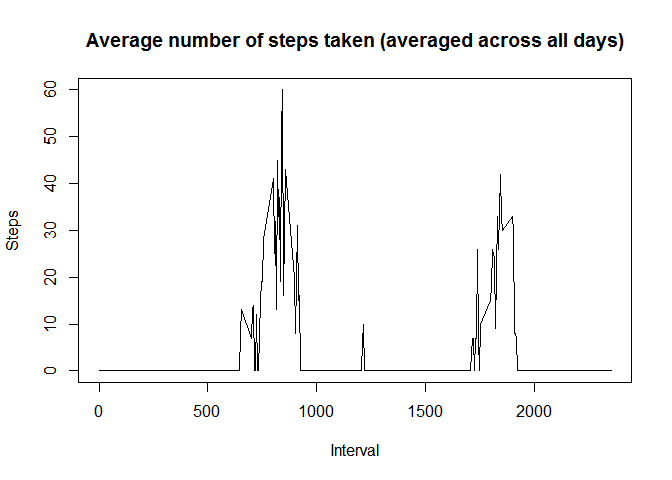
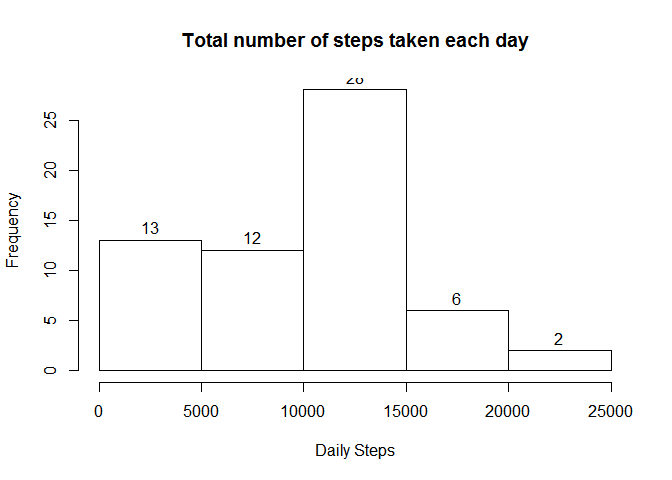
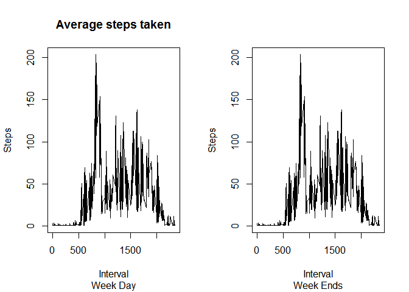

title: 'Reproducible Research: Peer Assessment 1'
-----------------------
 


**Loading and preprocessing the data**  

```r
unzip( "activity.zip", exdir=getwd())
activity_df <-read.csv("activity.csv")
```

**What is the mean total number of steps taken per day?**


Make a histogram of the total number of steps taken each day

```r
steps_df <- subset(activity_df,activity_df$steps != "NA")
totsteps <- aggregate(steps_df$steps, list(date = steps_df$date), sum)
hist( totsteps$x,labels=TRUE, xlab="Daily Steps",main="Total number of steps taken each day"  )
```

 
Calculate and report the mean and median total number of steps taken per day

```r
median(totsteps$x)
```

```
## [1] 10765
```

```r
mean(totsteps$x)
```

```
## [1] 10766.19
```
**What is the average daily activity pattern?**

Make a time series plot (i.e. type = "l") of the 5-minute interval (x-axis) and the average number of steps taken, averaged across all days (y-axis)

```r
totsteps <- aggregate(steps_df$steps, list(interval = steps_df$interval), median)
plot(totsteps$x~ totsteps$interval,type="l",main="Average number of steps taken (averaged across all days)",ylab="Steps",xlab="Interval" )
```

 

```r
meansteps <- mean(totsteps$x )
```

Which 5-minute interval, on average across all the days in the dataset, contains the maximum number of steps?

```r
totsteps[totsteps$x == max(totsteps$x),1]
```

```
## [1] 845
```

**Imputing missing values**

The stratergy for replacing missing values will include first replacing the missing steps with the mean number of steps per day.  If no steps for the entire day then use the mean steps for the interval across all days.

 Calculate and report the total number of missing values in the dataset (i.e. the total number of rows with NAs)
 
 ```r
  nrow( subset(activity_df,is.na(steps) ))
 ```
 
 ```
 ## [1] 2304
 ```
 
 Calculate the mean number of steps taken each day

```r
activity_df <-read.csv("activity.csv",stringsAsFactors=FALSE ) 
b <- read.csv("activity.csv",stringsAsFactors=FALSE ) 
for (i in 1 : nrow(b))
{   
  if (is.na(b$steps[i])  ) b$steps[i] <-  meansteps   ### mean steps across all intervals
}
totsteps <- aggregate(b$steps, list(date = b$date), sum)
hist( totsteps$x,labels=TRUE, xlab="Daily Steps",main="Total number of steps taken each day"  )
```

 

Calculate and report the mean and median total number of steps taken per day for imputed data

```r
median(totsteps$x)
```

```
## [1] 10395
```

```r
mean(totsteps$x)
```

```
## [1] 9503.869
```
***Are there differences in activity patterns between weekdays and weekends?***

```
## Warning: package 'timeDate' was built under R version 3.1.3
```


```r
b$weekpart <-ifelse (isWeekday( as.Date(b$date, "%Y-%m-%d")), "WeekDay", "WeekEnd")
totsteps <- aggregate(steps ~ weekpart + interval, data=b, mean)
par(mfrow=c(1,2))
with( totsteps[totsteps$weekpart=="WeekDay",], plot(totsteps$steps~ totsteps$interval,type="l",main="Average steps taken",sub="Week Day", ylab="Steps",xlab="Interval" ))

with( totsteps[totsteps$weekpart=="WeekEnd",], plot(totsteps$steps~ totsteps$interval,type="l",sub="Week Ends",ylab="Steps",xlab="Interval" ))
```

 
